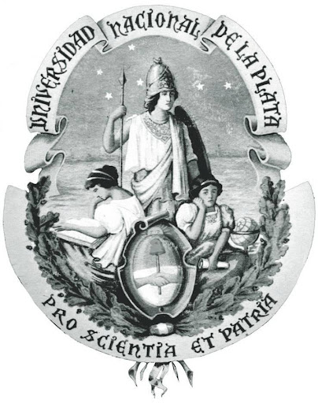

# GyG repository
## What you'll find in this repository? 
This repository was made with the purpose of work in different projects at the same time. On the other hand, the MAIN purpose of this repository lies on old experience as student...

So, if you think that there's something wrong in the code/documentation probably is wrong.

Here you can find differents projects made by Santiago Garaventta and Kevin Giribuela, both passionate with electronics and (as an Argentinian would said) very "culo inquieto".

Please, feel free to give us a feedback if you think that is necessary, we'll be VERY happy to open a pull request (specially if you are an engineer student from Universidad Nacional de La Plata)...

**Currently only ESP32 branch is ready to use**

## Who we are?
We're two electronics engineer, both proudly graduated from Universidad Nacional de La Plata.

## Why?
When we were students, we would have been very happy to know that someone had done the "dirty work" that was not related to the subject, especially when time is tight... 

Hence this repository tries help those students that are stuck with some kind of unnecessary work such as WebServer to pass wi-fi data to an ESP32, use and LCD display with I2C protocol, and so on.

 
